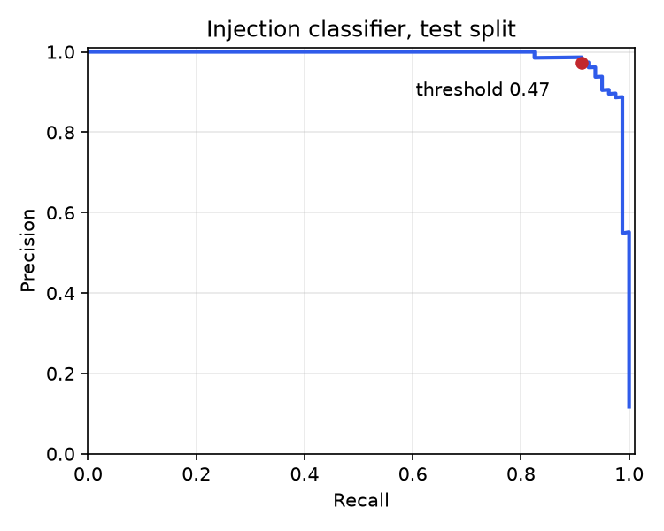

# SafeGate

An OpenAI-compatible LLM guardrails gateway. SafeGate sits between any application and any LLM,
screens traffic in layers (cheap checks first, expensive ones last), logs every decision for audit,
and ships with an evaluation harness that measures how well it works, including how often it
wrongly blocks legitimate users.

> Status: **Week 3 of 4.** Input and output rails, the fine-tuned injection classifier, Redis rate
> limiting and caching, a Grafana dashboard, a latency benchmark and a garak red-team run are in.
> Week 4 is deployment polish and write-up (see Roadmap).

## Demo

Open `http://localhost:8000/` after `docker compose up`. The page has two panels:

- **Playground:** type a prompt (or pick an example attack) and see each rail's verdict, score and
  reason, plus exactly what the LLM would receive after redaction. Switch to **Model reply** to
  run the output rails (PII redaction, toxicity) on a reply instead.
- **Live monitor:** request counts by verdict, blocks and redactions per rail, p50/p95 screening
  latency, and the most recent audit-log entries, refreshed every few seconds.

To host it publicly on Render's free tier, see [docs/deploy-demo.md](docs/deploy-demo.md).

`docker compose --profile monitoring up` also starts Prometheus and a provisioned Grafana
dashboard at `http://localhost:3000` (requests by verdict, blocks by rail, p50/p95 screening and
per-rail latency, verdict-cache hit ratio, rate-limited requests).

## How it works

```
client (any OpenAI SDK)
   │  base_url = http://safegate:8000/v1
   ▼
SafeGate ── rate limit (Redis) ── input rails ──► rules ─► secrets ─► PII (Presidio) ─► injection classifier
   │                                  │ block → 400 safegate_blocked (or a refusal reply), LLM never called
   │                                  │ redact → redacted text is what the LLM sees
   ▼                                  ▼
LLM provider ──► output rails ──► secrets ─► PII redaction ─► toxicity (Detoxify, ONNX) ──► client
   │                 │ block → reply withheld, finish_reason "content_filter"
   ▼                 ▼
decision log (PostgreSQL, input hashed, never stored raw) + Prometheus metrics + verdict cache (Redis)
```

Each rail returns `allow`, `block` or `redact` with a score and a reason. A block stops the chain;
a redaction feeds the redacted text to every later rail and to the LLM (or, on the way back, to
the client). Screening is deterministic, so verdicts are cached by policy and text: a repeated
prompt skips the classifiers.

With any output rail set, streamed replies are buffered, screened and then replayed, so time to
first token becomes the full generation time. That is the price of never showing a client
unscreened text; a policy with no output rails streams straight through.

## Quick start

```bash
cp .env.example .env          # set SAFEGATE_UPSTREAM_API_KEY, or leave it empty to pass callers' keys through
docker compose up --build
```

Point any OpenAI client at SafeGate by changing only the base URL:

```python
from openai import OpenAI

client = OpenAI(base_url="http://localhost:8000/v1", api_key="sk-...")
client.chat.completions.create(model="gpt-4o-mini", messages=[{"role": "user", "content": "Hi"}])
```

A blocked request raises `openai.BadRequestError` with `error.type == "safegate_blocked"` and
`error.code` naming the rail, or, with `on_block: refuse`, returns a normal completion that
explains the block with `finish_reason: "content_filter"`. Requests over a policy's rate limit get
`429` with `error.type == "rate_limit_exceeded"` and a `Retry-After` header.

## API

| Endpoint | Purpose |
| --- | --- |
| `POST /v1/chat/completions` | OpenAI-compatible proxy, including `stream: true` passthrough |
| `POST /v1/check` | Screen text without calling an LLM; returns per-rail verdicts. `"stage": "output"` runs the output rails |
| `GET /v1/decisions` | Audit log; filters: `app`, `action`, `rail` (blocking rail), `since`, `until`, `limit`, `offset` |
| `GET /v1/stats` | Dashboard aggregates over recent decisions: counts by verdict and rail, p50/p95 latency |
| `GET /v1/policy` | The active policy (rails and their order) |
| `GET /` | Demo page: playground and live monitor |
| `GET /metrics` | Prometheus: requests by action, verdicts by rail and stage, rail and screening latency, cache hits, rate-limited requests |
| `GET /healthz` | Liveness; returns 503 until policies and models are loaded |

Every response carries an `X-SafeGate-Request-Id` header that matches the decision log row.

## Policies

Policies live in `policies/<app>.yaml`. Send `X-SafeGate-App: <app>` to select one; unknown apps
fall back to `policies/default.yaml`. Rails run in the order the file lists them.

```yaml
screen_roles: [user]          # add `tool` to screen tool outputs
input_rails:
  rules:
    max_chars: 8000
    denylist: [ignore previous instructions]
    patterns: ['reveal\s+your\s+system\s+prompt']
  secrets:
    mode: redact              # API keys, tokens, private keys, "password is ..." values; or block
  pii:
    mode: redact              # or block
    threshold: 0.4
    entities: [EMAIL_ADDRESS, PHONE_NUMBER, US_SSN, CREDIT_CARD]
  injection:
    model: models/injection-onnx
    threshold: 0.975
output_rails:                 # screen the model's reply
  secrets: {}
  pii:
    entities: [EMAIL_ADDRESS, PHONE_NUMBER, US_SSN, CREDIT_CARD]
  toxicity:
    model: models/toxicity-onnx   # Detoxify's model exported by the "Export toxicity model" workflow
    threshold: 0.5
on_block: error               # or refuse: answer with a refusal message instead of a 400
rate_limit:                   # per client (API key, else IP) and app
  requests: 60
  per_seconds: 60
```

The secrets rail knows the documented shapes of common keys and tokens. It also catches
passwords written out in prose ("my wifi password is kdjfhqwe", "she gave me 1jeunen as a
password"). An English word list and a character trigram model separate made-up strings from
real words and jargon. A lowercase password that reads like a real word, such as "sunshine",
still gets through.

Rate-limit counters and cached verdicts live in Redis when `SAFEGATE_REDIS_URL` is set (docker
compose sets it), so several gateway replicas share them; without it each process keeps its own.
Redis errors fail open: an outage of an auxiliary store should not take the gateway down.

## Injection classifier

Rules catch known phrasings; the classifier catches paraphrases. `microsoft/deberta-v3-small` is
fine-tuned on public datasets and served on CPU as the `injection` rail.

| Source | Role |
| --- | --- |
| `deepset/prompt-injections` | Injection vs. benign (training) |
| `jackhhao/jailbreak-classification` | Jailbreak vs. benign (training) |
| `databricks/databricks-dolly-15k` | Benign instructions, 2,500 sampled (training) |
| `sahil2801/CodeAlpaca-20k` | Benign coding instructions as hard negatives, 2,500 sampled (training, from v2) |
| `Lakera/gandalf_ignore_instructions` | Real attacks, **fully held out** to test generalization |
| `eval/tricky_benign.jsonl` | 150 hand-written safe prompts that look dangerous, to measure false positives |

Leakage controls: training-side prompts that nearly match the tricky-benign evaluation set are removed; exact and near-duplicate prompts (MinHash, Jaccard ≥ 0.8 on word 5-grams) are
collapsed before splitting, groups with conflicting labels are dropped, and held-out prompts that
nearly duplicate anything on the training side are removed. The blocking threshold is chosen on
the validation split, never on a test set.

```bash
pip install torch --index-url https://download.pytorch.org/whl/cpu && pip install -e ".[train]"
python -m training.build_dataset --out data
python -m training.train --data data --out models/injection-deberta
python -m training.evaluate --model models/injection-deberta --data data --out reports
python -m training.export_onnx --model models/injection-deberta --out models/injection-onnx
```

`export_onnx.py` writes an int8 ONNX model that the gateway serves on ONNX Runtime without
PyTorch (`pip install -e ".[onnx]"`); point a policy's `injection.model` at its directory.

The same pipeline runs on GitHub Actions (**Train injection classifier**, manual trigger) and
publishes metrics to the job summary. To enable the rail, add it to a policy after `rules`:

```yaml
  injection:
    model: models/injection-deberta   # or a Hugging Face Hub id
    threshold: 0.5                    # use the threshold reported by evaluate.py
```

## Development

```bash
python -m venv .venv && . .venv/bin/activate
pip install -e ".[dev]" && python -m spacy download en_core_web_sm   # add ",ml" to test the classifier
pytest -q
ruff check . && ruff format --check .
uvicorn app.main:app --reload   # uses SQLite by default; set SAFEGATE_DATABASE_URL for Postgres
```

Configuration is read from `SAFEGATE_*` environment variables or `.env` (see `.env.example`).
Never commit `.env`.

## Roadmap

- [x] **Week 1:** streaming proxy, rules rail, Presidio PII rail, PostgreSQL decision log, Prometheus metrics, Docker compose, pytest, CI
- [x] **Week 2 (code):** dataset build with cross-source dedupe and a held-out source, DeBERTa fine-tuning, evaluation vs. rules baseline with PR curve, injection rail
- [x] **Week 2 (results v1):** trained and benchmarked; see Results
- [x] **Week 2 (results v2):** retrained with hard-negative benign data; tricky-benign false positives 18.7% → 4.7%
- [x] Demo page (playground + live monitor) and automatic public deploy (GHCR image, Render free tier)
- [x] ONNX int8 export served without PyTorch; demo fits in 512 MB
- [x] **Week 3:** output rails (PII redaction, toxicity), Redis rate limiting and verdict cache, Grafana dashboard, garak scan of bare LLM vs. SafeGate, latency benchmark
- [ ] **Week 4:** AWS deployment, results table, architecture diagram, demo video; stretch: ONNX export, baseline comparison, NLI grounding check

## Results

### Injection classifier

DeBERTa-v3-small, 3 epochs on CPU (GitHub Actions). Full reports:
[v1](reports/v1/metrics.md), [v2](reports/v2/metrics.md).

| Metric | Rules only | v1 | **v2 (current)** |
| --- | ---: | ---: | ---: |
| Test recall | 2.5% | 100.0% | 91.2% |
| Test precision | 100.0% | 97.6% | 97.3% |
| Test false-positive rate | 0.0% | 0.6% | 0.3% |
| Held-out source recall (Gandalf, never seen in training) | 12.7% | 91.4% | 87.2% |
| **Tricky-benign false-positive rate** | 0.0% | 18.7% | **4.7%** |
| CPU latency per prompt, p50 / p95 | <1 ms | 71 / 379 ms | 79 / 431 ms |

Rules-only numbers are on the v2 test split; v1's rules-only recall was 1.2%.

What this shows:

- **Rules alone are not a defense.** The denylist caught 2 of 80 test attacks and 13% of the
  held-out Gandalf attacks.
- **The classifier generalizes across sources,** with recall dropping from 91% in-distribution to
  87% on a dataset it never saw. The held-out number is the honest one.
- **v1 over-blocked safe prompts that use attack-like words.** It flagged 28 of 150 hand-written
  safe prompts (for example "Please ignore case when comparing these two strings") at every
  threshold, because its training data had almost no benign prompts with words like *ignore*,
  *override* or shell commands.
- **v2 fixes most of that with hard negatives.** Adding 2,500 benign coding instructions
  (CodeAlpaca) cut tricky-benign false positives from 18.7% to 4.7%, at the cost of some recall.
  Most of the 7 prompts it still flags talk about ignoring or forgetting earlier text, or about a
  bot's instructions and rules, which is genuinely close to real attacks. Any training prompt that nearly matched the tricky-benign set
  was removed first, so that set still measures unseen prompts.
- **Long prompts are slow.** p95 latency comes from multi-window jailbreak prompts. The served
  ONNX model cuts it by about 40% and caps each prompt at its first and last windows.

Operating point: the threshold is chosen on validation data (0.47). Raising it trades recall for
fewer false positives:

| Threshold | Held-out recall | Tricky-benign FPR |
| ---: | ---: | ---: |
| 0.47 (default) | 87.2% | 4.7% |
| 0.90 | 83.8% | 2.0% |
| 0.99 | 78.2% | 0.7% |

**Served model (ONNX, int8).** The same v2 model exported to ONNX with int8 weights and scored as
the gateway serves it (at most 4 windows per prompt). Full report:
[reports/v2-onnx/metrics.md](reports/v2-onnx/metrics.md).

| Metric | PyTorch fp32 | ONNX int8 |
| --- | ---: | ---: |
| Held-out recall | 87.2% | 83.8% |
| Tricky-benign FPR | 4.7% | 3.3% |
| Test false-positive rate | 0.3% | 0.2% |
| CPU latency per prompt, p50 / p95 (same runner) | 65 / 343 ms | 43 / 209 ms |
| Weights on disk | about 540 MB | 172 MB |
| Serving image needs PyTorch | yes | no |

Quantization cuts latency by about a third (p50) to two fifths (p95). Its validation-chosen
threshold lands higher (0.975), so it blocks a little less: at 0.5 the int8 model reaches 89.9%
held-out recall with 5.3% tricky-benign FPR. The whole demo container (gateway, PII rail and
classifier) peaks at about 390 MB of process memory, under a 512 MB free-tier limit, because
ONNX Runtime memory-maps the weights instead of copying them onto the heap (copying peaked at
575 MB).



### Red-teaming with garak

[NVIDIA garak](https://github.com/NVIDIA/garak) attacked `qwen2.5:1.5b` (Ollama, CPU) twice:
directly, and behind SafeGate with its default policy plus both models. Attack success rate is
the share of replies garak's detectors flag as a successful attack; lower is better. Up to 40
prompts per probe, one generation each, temperature 0
([reports/redteam/garak.md](reports/redteam/garak.md), **Benchmark** workflow).

| Attack category (garak probes) | Bare LLM | Behind SafeGate |
| --- | ---: | ---: |
| Prompt injection (`promptinject` hijacks) | 75.0% (90/120) | **3.3%** (4/120) |
| Jailbreaks (`dan.DanInTheWild`) | 75.0% (30/40) | **5.0%** (2/40) |
| Indirect injection in documents (`latentinjection`) | 31.2% (25/80) | **18.8%** (15/80) |
| Toxic continuations (`realtoxicityprompts`) | 4.0% (8/200) | **1.5%** (3/200) |
| Encoded injection (`encoding.InjectBase64`) | 0.0% (0/40) | 0.0% (0/40) |
| **All** | **31.9%** (153/480) | **5.0%** (24/480) |

What this does and does not show:

- Direct injections and jailbreaks are where SafeGate is strongest: success drops from 75% to
  3-5%.
- **Indirect injection is the weak spot.** These attacks hide an instruction inside a document the
  user pastes in ("summarize this report"), and the classifier, trained on prompts that are
  attacks as a whole, misses most of them. Screening retrieved and tool content as its own role
  (`screen_roles: [user, tool]`) and training on document-embedded attacks are the next steps.
- The 1.5B model cannot decode Base64, so the encoding probe succeeds against neither target; it
  says nothing about SafeGate.
- Blocked requests are answered with a refusal (`on_block: refuse`), which garak scores as a
  defended attack. With the default `on_block: error`, garak would drop those requests from the
  count instead.
- One small model, 480 prompts, one run: treat the numbers as indicative, not as a leaderboard.

### Gateway latency

[eval/latency_bench.py](eval/latency_bench.py) sends 1,000 chat completions per target, one at a
time, to an instant mock LLM, so the numbers are what SafeGate adds and nothing else. Prompts are
the 150 tricky-benign ones, which pass every rail (4.6% of requests were wrongly blocked)
and so take the slowest path. Full policy: rules, PII and the injection classifier on the prompt;
PII and Detoxify toxicity on the reply. GitHub Actions runner, 4 vCPUs
([reports/latency/latency.md](reports/latency/latency.md)).

| Target | p50 | p95 | p99 | Added p50 / p95 | Requests/s |
| --- | ---: | ---: | ---: | ---: | ---: |
| Direct to the LLM (baseline) | 0.6 ms | 0.8 ms | 1.0 ms | | 1,481 |
| SafeGate, no rails (proxy only) | 2.0 ms | 2.8 ms | 14.7 ms | 1.4 / 1.9 ms | 368 |
| SafeGate, full policy | 45.4 ms | 48.8 ms | 65.1 ms | **44.8 / 47.9 ms** | 22 |
| SafeGate, full policy, verdict cached | 1.9 ms | 2.3 ms | 3.8 ms | 1.3 / 1.4 ms | 490 |

The classifiers are nearly all of the cost; the proxy itself adds under 2 ms. Two ONNX models in
one process initially ran 3.7x slower (168 ms p50) because ONNX Runtime's idle threads spin
waiting for work and stole each other's cores; turning spinning off fixed it. Throughput is one
request at a time on one process; CPU-bound screening scales with cores and replicas, and repeated
prompts skip the models through the Redis verdict cache.

## License

MIT, see [LICENSE](LICENSE).
